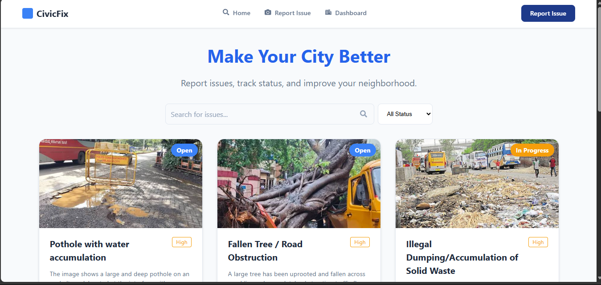
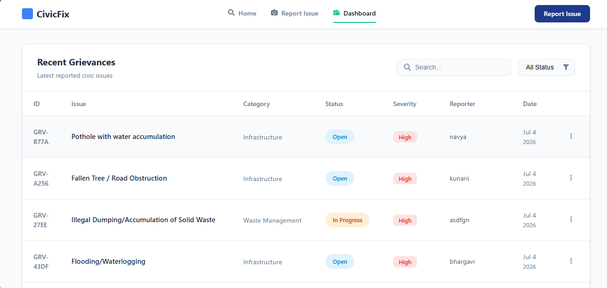
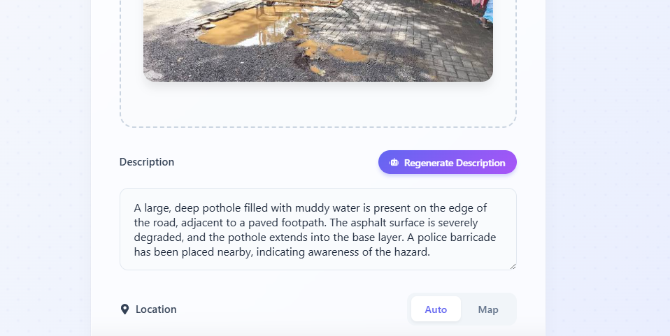
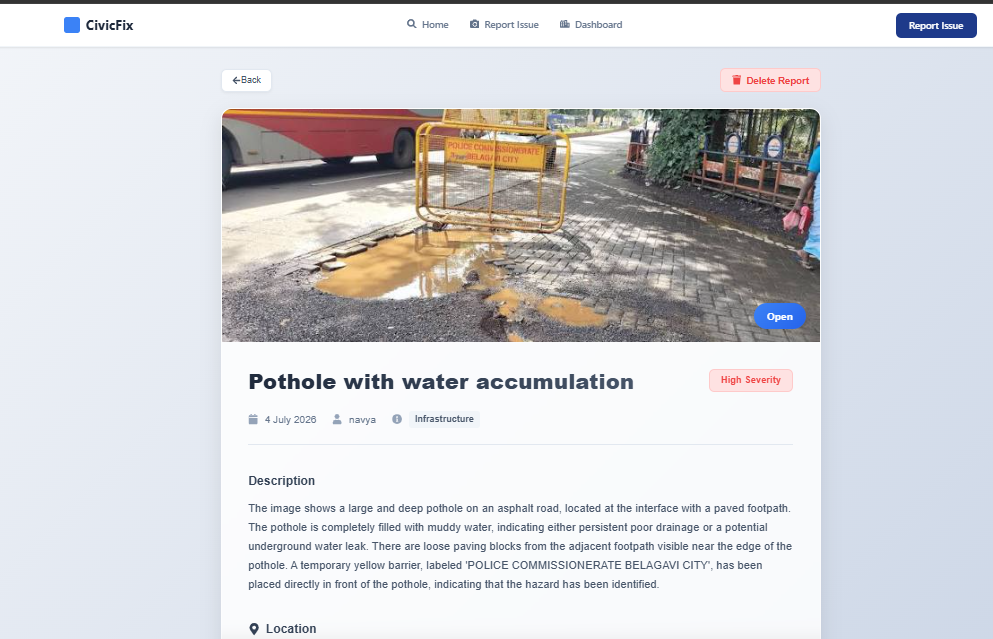
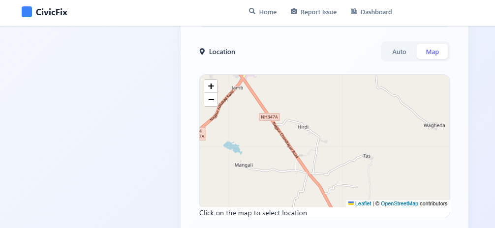

# 🚀 CivicFix

An AI-powered Civic Issue Reporting System that allows citizens to report infrastructure issues such as potholes, garbage, water leakage, damaged streetlights, and road obstructions.

The system uses **Google Gemini AI** for image analysis and **Pinecone Vector Database** for semantic duplicate detection.

---

## ✨ Features

- AI Image Analysis
- Automatic Issue Classification
- Severity Prediction
- Duplicate Detection using Pinecone
- Admin Dashboard
- Complaint Tracking
- High Priority Zone Detection

---

## 🛠 Tech Stack

### Frontend
- React.js
- CSS
- Axios

### Backend
- Node.js
- Express.js

### Database
- MongoDB Atlas

### AI
- Google Gemini AI

### Vector Database
- Pinecone
  ## 📸 Screenshots

### Home Page

---

### Report Issue

---

### Dashboard

---

### AI ANALYSIS View

---

### VIEW DETAILS

### 🗺️ Map View

The interactive map displays reported issues with their locations, allowing users and administrators to quickly identify problem areas.

---

### 👤 User Details

This page displays citizen information, complaint details, report status, and other relevant information for effective issue management.

